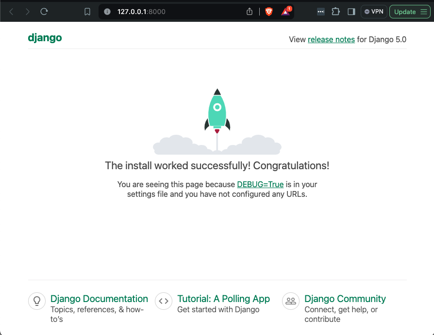

# Generar un Proyecto Django

## Requerimientos Mínimos
- **Python** 3.8 o superior
- **pip** (el gestor de paquetes de Python)
- **Virtualenv** (recomendado para crear entornos virtuales aislados)
- **Django** (el framework web)

## Programas a Utilizar
- **Python**: [Descargar aquí](https://www.python.org/downloads/)
- **pip**: Incluido con Python
- **Virtualenv**: Se puede instalar usando pip
- **Django**: Se puede instalar usando pip

## Pasos para Generar el Proyecto
**1. Instalar Python**

Asegúrate de tener Python instalado. Puedes descargarlo e instalarlo desde [python.org](https://www.python.org/downloads/).

**2. Crear un Entorno Virtual**

Es una buena práctica trabajar en un entorno virtual para mantener las dependencias de tu proyecto aisladas. Para instalar `virtualenv` si no lo tienes ya:
```shell
pip install virtualenv
```
Luego, crea un entorno virtual y actívalo:
```shell
# En sistemas Unix/Mac
python3 -m venv myenv
source myenv/bin/activate

# En sistemas Windows
python -m venv myenv
myenv\Scripts\activate
```
Revisa [esta información](ENTORNO_VIRTUAL.MD) adicional sobre entornor virutales.

**3. Instalar Django**

Con el entorno virtual activado, instala Django utilizando pip:
```shell
pip install django
```

**4. Crear el Proyecto Django**

Una vez que Django esté instalado, puedes crear un nuevo proyecto utilizando el comando `django-admin`:
```shell
django-admin startproject myproject
```
Esto creará un nuevo directorio llamado myproject que contendrá la estructura básica del proyecto Django.

**5. Ejecutar el Servidor de Desarrollo**

Navega al directorio del proyecto y ejecuta el servidor de desarrollo para asegurarte de que todo esté configurado correctamente:
```shell
cd myproject
python manage.py runserver
```

Deberías ver un mensaje indicando que el servidor está corriendo y puedes acceder a tu nuevo proyecto en `http://127.0.0.1:8000/`.



**6. Crear una Aplicación dentro del Proyecto**

Dentro del proyecto, puedes crear aplicaciones individuales que gestionen diferentes funcionalidades. Para crear una nueva aplicación, usa el comando:
```shell
python manage.py startapp myapp
```

**7. Migrar la Base de Datos**

Django utiliza migraciones para aplicar cambios en la base de datos. Ejecuta las siguientes órdenes para crear las tablas necesarias en tu base de datos:
```shell
python manage.py makemigrations
python manage.py migrate
```

## Resumen de Comandos

```shell
# Crear y activar un entorno virtual
python3 -m venv myenv
source myenv/bin/activate       # Unix/Mac
myenv\Scripts\activate          # Windows

# Instalar Django
pip install django

# Crear un nuevo proyecto Django
django-admin startproject myproject

# Navegar al directorio del proyecto y ejecutar el servidor
cd myproject
python manage.py runserver

# Crear una nueva aplicación
python manage.py startapp myapp

# Migrar la base de datos
python manage.py makemigrations
python manage.py migrate
```

## Documentación adicional:

- [Crear un modelo](CREAR_MODELOS.MD)
- [Implementar operaciones CRUD sobre el modelo creado](IMPLEMENTAR_CRUD.MD)

**Notas**

- Asegúrate de tener todos los requisitos mínimos instalados antes de comenzar.
- Es recomendable trabajar dentro de un entorno virtual para evitar conflictos con otras dependencias de Python.
- Consulta la documentación oficial de Django para más información y guías avanzadas: [Documentación de Django](https://docs.djangoproject.com/).
