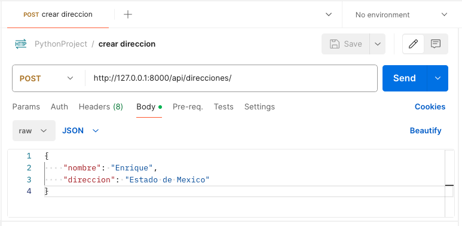
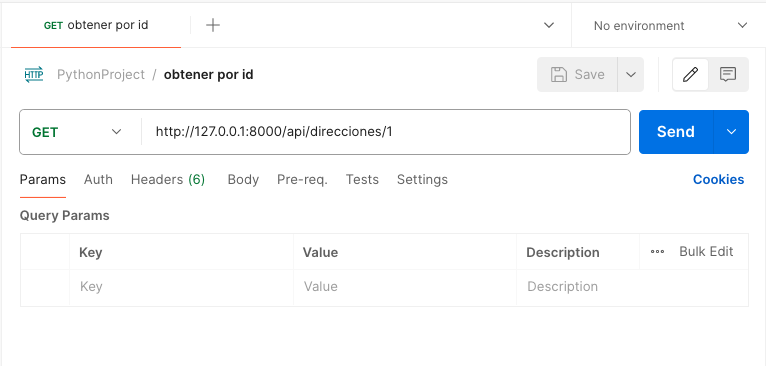
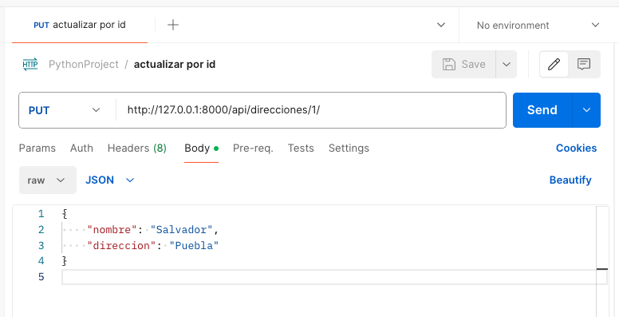
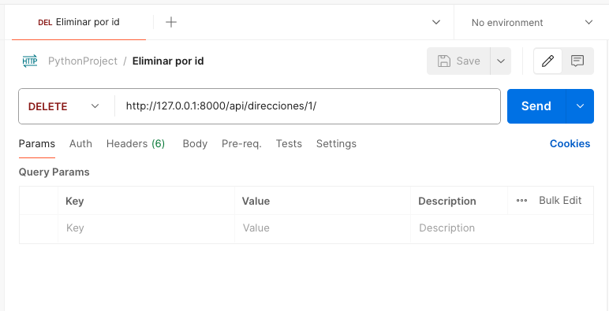

# Implementar operaciones CRUD

Para implementar operaciones CRUD (_Create, Read, Update, Delete_ / _Crear, Leer, Actualizar, Eliminar_) sobre un modelo, realizaremos lo siguiente:

**NOTA:** Antes de implementar tus operaciones CRUD asegurate de haber creado el modelo correspondiente, para ello puedes revisar [esta documentación](CREAR_MODELOS.MD) que habla al respecto y en donde creamos el modelo `Direccion` el cual utilizaremos en este ejemplo.

**1. Crear la vista**

Define las vistas utilizando viewsets en `views.py`:
```python
# ecommerce/views.py
from rest_framework import viewsets
from .models import Direccion
from .serializers import DireccionSerializer

class DireccionViewSet(viewsets.ModelViewSet):
queryset = Direccion.objects.all()
serializer_class = DireccionSerializer
```

**2. Configurar URLs para las Vistas**

Configura las URLs en urls.py de tu aplicación:
```python
# ecommerce/urls.py
from django.urls import path, include
from rest_framework.routers import DefaultRouter
from .views import DireccionViewSet

router = DefaultRouter()
router.register('direcciones', DireccionViewSet)

urlpatterns = [
    path('', include(router.urls)),
]
```

Y asegúrate de incluir las rutas de tu aplicación en el archivo `urls.py` de tu proyecto:
```python
# myproject/urls.py
from django.contrib import admin
from django.urls import path, include

urlpatterns = [
    path('admin/', admin.site.urls),
    path('api/', include('myapp.urls')),  # Ajusta el nombre de tu aplicación si es necesario
]
```

**3. Probar los Endpoints**

Levanta el servidor de desarrollo y prueba los endpoints utilizando una herramienta como `Postman` o `curl`:
```shell
python manage.py runserver
```

Los endpoints disponibles deberían ser:

- **GET** _/api/direcciones/_ - Listar todas las direcciones


- **POST** _/api/direcciones/_ - Crear una nueva dirección, payload de ejemplo:
```json
{
    "nombre": "Enrique",
    "direccion": "Estado de Mexico"
}
```


- **GET** _/api/direcciones/**{id}**/_ - Obtener una dirección por ID



- **PUT** _/api/direcciones/**{id}**/_ - Actualizar una dirección por ID, payload de ejemplo:
```json
{
    "nombre": "Salvador",
    "direccion": "Puebla"
}
```


- **DELETE** _/api/direcciones/**{id}**/_ - Eliminar una dirección por ID



Con estos pasos, tendrás un conjunto de endpoints CRUD completamente funcional para manejar la información de tu módulo, en este caso la tabla de direcciones.